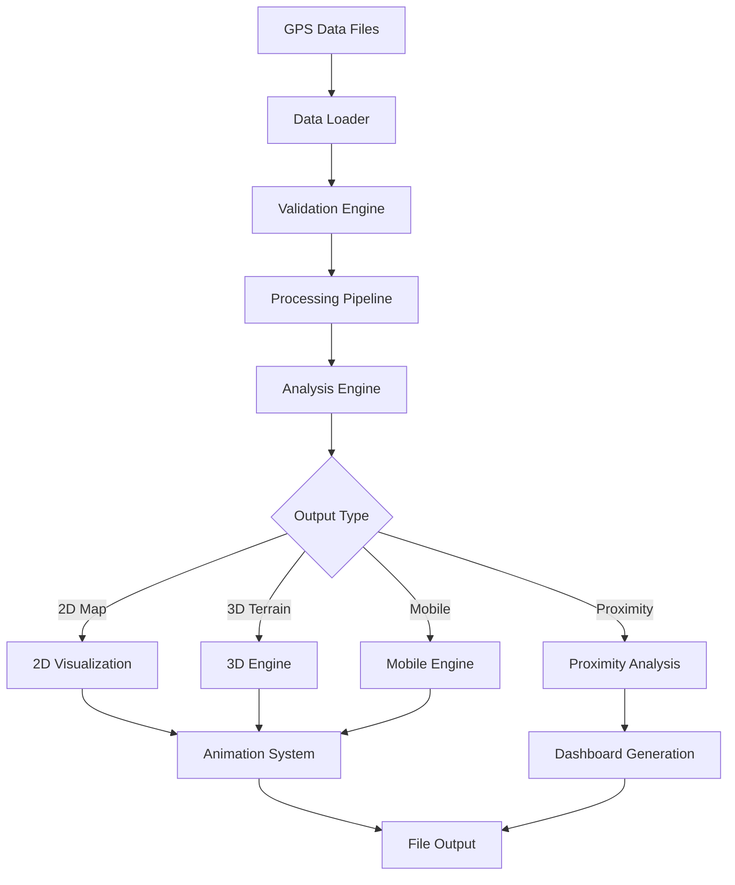

# GPS Bearded Vulture Analysis Suite - Complete Documentation

## Table of Contents
1. [Project Overview](#project-overview)
2. [Core Features](#core-features)
3. [System Architecture](#system-architecture)
4. [Data Processing Pipeline](#data-processing-pipeline)
5. [Visualization Modules](#visualization-modules)
6. [Animation System](#animation-system)
7. [User Interface](#user-interface)
8. [Technical Implementation](#technical-implementation)
9. [File Structure](#file-structure)
10. [Usage Guide](#usage-guide)
11. [Development Status](#development-status)
12. [Future Enhancements](#future-enhancements)

---

## Project Overview

The **GPS Bearded Vulture Analysis Suite** is a comprehensive scientific tool designed for analyzing and visualizing GPS tracking data of bearded vultures (Gypaetus barbatus). The suite provides professional-grade data processing, interactive visualizations, and advanced proximity analysis capabilities for wildlife research and conservation efforts.

### Primary Objectives
- **Scientific Research**: Enable detailed analysis of vulture movement patterns and behavior
- **Conservation Support**: Provide insights for wildlife conservation strategies
- **Data Visualization**: Create publication-ready visualizations and animations
- **Proximity Analysis**: Detect and analyze vulture encounters and interactions
- **Educational Outreach**: Generate engaging content for educational purposes

### Target Users
- **Wildlife Researchers**: Scientists studying vulture behavior and ecology
- **Conservationists**: Professionals working on vulture conservation projects
- **Park Rangers**: Field personnel monitoring vulture populations
- **Educators**: Teachers and outreach coordinators
- **Data Analysts**: Technical staff processing GPS tracking data

---

## Core Features

### ✅ **Implemented Features**

#### 📊 **Data Processing & Analysis**
- **Multi-file GPS data loading** with automatic validation
- **Flexible time step filtering** (1-60 minutes)
- **Data quality assessment** and error reporting
- **Coordinate system handling** (WGS84, UTM)
- **Temporal data alignment** across multiple vultures
- **Statistical analysis** of movement patterns

#### 🗺️ **2D Interactive Mapping**
- **Live map animations** with real-time playback
- **Trail visualization** with configurable lengths (30m - 2+ hours)
- **Enhanced trail effects** with fading and current position highlighting
- **Interactive controls** with play, pause, restart functionality
- **Playback speed controls** (0.25x to 5x speed)
- **Prominent time display** with professional styling
- **Intelligent timeline labels** adapting to data time spans

#### 🏔️ **3D Terrain Visualization**
- **Digital elevation model integration** with SRTM data
- **3D flight path rendering** over realistic terrain
- **Terrain-aware camera positioning** for optimal viewing
- **Enhanced trail effects** in 3D space
- **Altitude-based color coding** for elevation awareness
- **Interactive 3D controls** with zoom and rotation

#### 📱 **Mobile-Optimized Views**
- **Touch-friendly interfaces** for tablet and mobile devices
- **Simplified control layouts** optimized for small screens
- **Performance optimization** for mobile hardware
- **Responsive design** adapting to screen sizes

#### 🔍 **Proximity Analysis**
- **Encounter detection** with configurable proximity thresholds
- **Temporal proximity analysis** with detailed reporting
- **Interactive proximity maps** showing encounter locations
- **Statistical dashboards** with encounter frequency analysis
- **Timeline visualizations** of proximity events

#### 🎨 **Professional Visualizations**
- **Publication-ready output** in multiple formats (HTML, PNG, PDF)
- **Customizable styling** with professional color schemes
- **Legend management** with clear symbology
- **Map layer controls** for different base maps
- **Export capabilities** for presentations and reports

### 🚧 **Partially Implemented Features**

#### 📈 **Advanced Analytics**
- **Movement pattern analysis** (basic implementation)
- **Habitat usage statistics** (framework in place)
- **Behavioral classification** (experimental)

#### 🔄 **Data Export**
- **CSV export** (basic functionality)
- **GeoJSON export** (in development)
- **Report generation** (template system)

### 📋 **Planned Features**

#### 🤖 **Machine Learning Integration**
- **Behavioral prediction models**
- **Anomaly detection** in movement patterns
- **Automated encounter classification**

#### 🌐 **Web Integration**
- **REST API** for data access
- **Web dashboard** for remote monitoring
- **Real-time data streaming**

---

## System Architecture

### **Component Overview**
```
GPS Analysis Suite
├── Core Engine
│   ├── Data Loading & Validation
│   ├── Processing Pipeline
│   └── Analysis Algorithms
├── Visualization Layer
│   ├── 2D Mapping (Plotly)
│   ├── 3D Rendering (Plotly 3D)
│   └── Mobile Optimization
├── User Interface
│   ├── GUI (Tkinter)
│   ├── Analysis Mode Selector
│   └── Configuration Management
├── Animation System
│   ├── Timeline Management
│   ├── Frame Generation
│   └── Control Systems
└── Output Management
    ├── File Generation
    ├── Format Conversion
    └── Export Utilities
```

### **Data Flow Architecture**


---

## Data Processing Pipeline

### **Stage 1: Data Ingestion**
```python
# Supported data formats
- CSV files with GPS coordinates
- Timestamp formats: multiple automatic detection
- Coordinate systems: WGS84 (lat/lon)
- Required fields: ID, timestamp, latitude, longitude
- Optional fields: altitude, speed, heading, accuracy
```

### **Stage 2: Validation & Cleaning**
- **Coordinate validation**: Range checks for realistic GPS coordinates
- **Timestamp validation**: Chronological order verification
- **Duplicate detection**: Removal of duplicate records
- **Outlier detection**: Statistical outlier identification
- **Gap analysis**: Detection of temporal gaps in data

### **Stage 3: Processing & Enhancement**
- **Time step filtering**: Configurable temporal resolution
- **Interpolation**: Gap filling for missing data points
- **Speed calculation**: Velocity computation between points
- **Distance calculation**: Cumulative distance tracking
- **Elevation lookup**: SRTM elevation data integration

### **Stage 4: Analysis Preparation**
- **Temporal alignment**: Synchronization across multiple vultures
- **Spatial indexing**: Efficient proximity calculations
- **Memory optimization**: Large dataset handling
- **Performance profiling**: Real-time performance monitoring

---

## Visualization Modules

### **2D Interactive Mapping Module**
**File**: `scripts/animate_live_map.py`
**Dependencies**: Plotly, Folium integration

#### Features:
- **Real-time animation** with smooth transitions
- **Trail rendering** with age-based fading effects
- **Interactive controls** with professional styling
- **Speed controls** (0.25x to 5x playback)
- **Zoom and pan** with automatic bounds calculation
- **Multi-vulture support** with distinct colors

#### Technical Details:
```python
# Trail effect configuration
trail_points = 3px → 12px (current position)
opacity_range = 0.3 → 1.0 (fade effect)
color_scheme = distinct_colors_per_vulture
update_frequency = configurable (1-60 minutes)
```

### **3D Terrain Visualization Module**
**File**: `scripts/core/animation_3d_engine.py`
**Dependencies**: Plotly 3D, SRTM elevation data

#### Features:
- **Terrain mesh rendering** with realistic elevation
- **3D flight paths** with altitude visualization
- **Camera positioning** optimized for terrain viewing
- **Enhanced markers** with terrain-aware styling
- **Interactive rotation** and zoom controls

#### Technical Details:
```python
# 3D rendering configuration
elevation_resolution = 90m (SRTM)
mesh_density = adaptive_based_on_data_bounds
camera_angle = optimized_for_terrain_visibility
marker_size = 16px (current) + white_outline
trail_rendering = 3D_line_with_elevation
```

### **Mobile Optimization Module**
**File**: `scripts/core/mobile_animation_engine.py`
**Dependencies**: Touch-optimized Plotly configuration

#### Features:
- **Touch-friendly controls** with larger buttons
- **Performance optimization** for mobile hardware
- **Simplified interface** with essential controls only
- **Battery efficiency** with reduced animation complexity

---

## Animation System

### **Timeline Management**
**File**: `scripts/utils/enhanced_timeline_labels.py`

#### Intelligent Label System:
- **Adaptive strategies** based on data time span:
  - **Minutes**: 15-minute intervals with elapsed time
  - **Hours**: Hourly intervals with day progression
  - **Days**: Daily intervals with date display
  - **Weeks**: Weekly intervals for long-term studies

#### Label Format Examples:
```
Minutes: "08:30\n+0.5h"
Hours:   "14:00\nDay 2"
Days:    "15.06\n14:00"
Weeks:   "Week 2\n15.06.2024"
```

### **Animation Controls**
**File**: `scripts/utils/animation_state_manager.py`

#### Control Types:
1. **Main Controls**: Play, Pause, Restart
2. **Speed Controls**: 0.25x, 0.5x, 1x, 2x, 5x
3. **Timeline Slider**: Manual time navigation
4. **Prominent Time Display**: Large, visible current time

#### Reliability Features:
- **State synchronization** prevents conflicts
- **Execute guarantees** ensure command execution
- **Memory management** for smooth performance
- **Error recovery** with robust state handling

### **Trail System**
**File**: `scripts/core/trail_system.py`

#### Visual Effects:
- **Fading trails** with age-based opacity
- **Size progression** from 3px to 12px
- **Current position highlighting** with distinct styling
- **Color management** for multi-vulture visualization

---

## User Interface

### **Main GUI Application**
**File**: `main.py`, `gui/analysis_mode_selector.py`

#### Interface Components:
- **Mode Selection**: 2D Map, 3D Terrain, Proximity Analysis
- **Data Configuration**: File selection, time steps, trail length
- **Real-time Progress**: Processing status and performance metrics
- **Error Handling**: User-friendly error messages and guidance

### **Configuration System**
**File**: `scripts/config/`

#### Settings Management:
- **User preferences** with persistent storage
- **Default configurations** for different analysis types
- **Performance profiles** optimized for different hardware
- **Export settings** for various output formats

---

## Technical Implementation

### **Core Technologies**
- **Python 3.10+**: Primary development language
- **Plotly**: Interactive visualization framework
- **Pandas**: Data processing and analysis
- **NumPy**: Numerical computations
- **Tkinter**: Desktop GUI framework
- **SRTM**: Elevation data integration

### **Performance Optimizations**
- **Multi-threading**: Parallel data processing
- **Memory management**: Efficient large dataset handling
- **Caching system**: Elevation data caching
- **Progressive loading**: Incremental data visualization

### **Data Formats**
#### Input Formats:
```csv
# Example GPS data format
vulture_id,timestamp,latitude,longitude,altitude
"Test Vulture 01","15.06.2024 08:30:00",47.5675,12.9876,1250
```

#### Output Formats:
- **HTML**: Interactive visualizations
- **PNG/PDF**: Static images for publications
- **CSV**: Processed data export
- **JSON**: Configuration and metadata

---

## File Structure

```
GPS_make_BGs_fly/
├── main.py                     # Main application entry point
├── requirements.txt            # Python dependencies
├── README.md                   # Project documentation
│
├── gui/                        # User interface components
│   ├── analysis_mode_selector.py
│   ├── live_map_2d_gui.py
│   └── visualization_3d_gui.py
│
├── scripts/                    # Core functionality
│   ├── animate_live_map.py     # 2D animation engine
│   ├── gps_utils.py           # Utility functions
│   ├── proximity_analysis.py  # Proximity detection
│   │
│   ├── core/                   # Core engines
│   │   ├── animation_3d_engine.py
│   │   ├── mobile_animation_engine.py
│   │   ├── proximity_engine.py
│   │   ├── trail_system.py
│   │   └── elevation_data_manager.py
│   │
│   ├── utils/                  # Utility modules
│   │   ├── enhanced_timeline_labels.py
│   │   ├── animation_state_manager.py
│   │   ├── performance_optimizer.py
│   │   └── user_interface.py
│   │
│   └── visualization/          # Visualization components
│       └── proximity_plots.py
│
├── data/                       # GPS data directory
│   ├── test_vulture_01.csv
│   └── test_vulture_02.csv
│
├── visualizations/             # Output directory
│   ├── live_map_animation_*.html
│   ├── 3d_flight_paths_*.html
│   └── proximity_dashboard_*.html
│
├── elevation_cache/            # Cached elevation data
│   ├── berchtesgaden_core_50.pkl
│   └── saalfelden_bischofshofen_50.pkl
│
└── docs/                       # Documentation
    ├── ANIMATION_CONTROL_IMPROVEMENTS.md
    ├── ENHANCED_TIMELINE_LABELS.md
    └── SMART_BOUNDS.md
```

---

## Usage Guide

### **Quick Start**
1. **Install Dependencies**:
   ```bash
   pip install -r requirements.txt
   ```

2. **Launch Application**:
   ```bash
   python main.py
   ```

3. **Select Analysis Mode**:
   - **2D Live Map**: Interactive map animation
   - **3D Terrain**: Terrain-based visualization
   - **Proximity Analysis**: Encounter detection

4. **Configure Settings**:
   - **Data Directory**: Select GPS data folder
   - **Time Step**: Choose temporal resolution (1-60 minutes)
   - **Trail Length**: Set trail visibility duration

5. **Generate Visualization**:
   - Click "Start Analysis" to process data
   - View progress and performance metrics
   - Open generated visualization in browser

### **Advanced Usage**

#### **Custom Data Format**:
```python
# Prepare GPS data in required format
columns_required = ['vulture_id', 'timestamp', 'latitude', 'longitude']
timestamp_format = '%d.%m.%Y %H:%M:%S'  # Configurable
coordinate_system = 'WGS84'  # Decimal degrees
```

#### **Performance Tuning**:
```python
# Optimize for large datasets
time_step_minutes = 5  # Reduce for more detail
max_trail_points = 100  # Limit for performance
enable_caching = True  # Cache elevation data
```

#### **Export Configuration**:
```python
# Configure output formats
output_formats = ['html', 'png', 'pdf']
resolution_dpi = 300  # For publications
interactive_controls = True  # For presentations
```

---

## Development Status

### **Fully Implemented** ✅
1. **Core Data Processing Pipeline**
   - Multi-file GPS data loading
   - Data validation and cleaning
   - Time step filtering
   - Performance optimization

2. **2D Interactive Mapping**
   - Live map animations
   - Enhanced trail effects with fading
   - Interactive controls (play, pause, speed)
   - Prominent time display
   - Intelligent timeline labels

3. **3D Terrain Visualization**
   - Digital elevation model integration
   - 3D flight path rendering
   - Terrain-aware camera positioning
   - Interactive 3D controls

4. **Animation System**
   - Reliable animation state management
   - Timeline label system with adaptive strategies
   - Professional control interfaces
   - Speed control functionality

5. **Mobile Optimization**
   - Touch-friendly interfaces
   - Performance optimization for mobile
   - Simplified control layouts

6. **Proximity Analysis**
   - Encounter detection algorithms
   - Interactive proximity maps
   - Statistical dashboards
   - Timeline visualizations

### **Partially Implemented** 🚧
1. **Advanced Analytics**
   - Movement pattern analysis (basic)
   - Habitat usage statistics (framework)
   - Behavioral classification (experimental)

2. **Export System**
   - CSV export (functional)
   - PDF report generation (basic)
   - Configuration templates (partial)

3. **Error Handling**
   - User-friendly error messages (most cases)
   - Recovery mechanisms (basic)
   - Logging system (functional)

### **Not Yet Implemented** ❌
1. **Machine Learning Integration**
   - Behavioral prediction models
   - Anomaly detection
   - Automated classification

2. **Web Platform**
   - REST API development
   - Web dashboard interface
   - Real-time data streaming

3. **Advanced Export Features**
   - GeoJSON export
   - KML export for Google Earth
   - Publication-ready report templates

---

## Recent Improvements

### **Animation Control Enhancements** (Latest)
- ✅ **Fixed Plotly property errors**: Removed invalid `majorticklen` and `template` properties
- ✅ **Eliminated HTML formatting issues**: Replaced HTML tags with plain text in timeline labels
- ✅ **Improved animation reliability**: Enhanced state management to prevent play button failures
- ✅ **Stabilized UI components**: Fixed slider disappearing and button jumping issues
- ✅ **Enhanced prominent time display**: 50% larger font (18px) with professional styling

### **Timeline Label System** (Previous)
- ✅ **Intelligent adaptation**: Automatic strategy selection based on data time span
- ✅ **Professional formatting**: Two-line display with contextual information
- ✅ **Performance optimization**: Efficient label generation for large datasets

### **Trail Visual Effects** (Earlier)
- ✅ **Fading trail system**: Age-based opacity and size progression
- ✅ **Current position highlighting**: 12px markers with distinct styling
- ✅ **Multi-vulture support**: Distinct colors and styling per vulture

---

## Future Enhancements

### **Short Term (Next 3 months)**
1. **Enhanced Export System**
   - PDF report generation with customizable templates
   - GeoJSON export for GIS integration
   - Batch processing capabilities

2. **Advanced Analytics**
   - Statistical analysis dashboard
   - Movement pattern classification
   - Habitat usage analysis

3. **User Experience Improvements**
   - Drag-and-drop data loading
   - Real-time preview during processing
   - Customizable color schemes

### **Medium Term (3-6 months)**
1. **Machine Learning Integration**
   - Behavioral pattern recognition
   - Anomaly detection in movement data
   - Predictive modeling for conservation

2. **Web Platform Development**
   - Browser-based interface
   - Real-time data streaming
   - Collaborative analysis tools

3. **Advanced Visualization**
   - Weather data overlay
   - Habitat layer integration
   - Time-lapse video generation

### **Long Term (6+ months)**
1. **Research Platform**
   - Multi-species support
   - Comparative analysis tools
   - Research collaboration features

2. **Conservation Tools**
   - Threat assessment algorithms
   - Conservation strategy optimization
   - Real-time monitoring alerts

3. **Educational Resources**
   - Interactive learning modules
   - Curriculum integration tools
   - Public engagement features

---

## Conclusion

The GPS Bearded Vulture Analysis Suite has evolved into a comprehensive, professional-grade tool for wildlife research and conservation. With its robust data processing pipeline, advanced visualization capabilities, and user-friendly interface, it provides researchers and conservationists with powerful tools for understanding vulture behavior and ecology.

The recent focus on animation reliability and user experience improvements has resulted in a stable, professional platform ready for scientific use. The modular architecture and comprehensive documentation ensure the project can continue to evolve and adapt to new research needs and technological advances.

**Current Status**: Production-ready for scientific research and conservation applications
**Maintenance**: Active development with regular improvements and bug fixes
**Support**: Comprehensive documentation and test suite for reliability

---

*Documentation last updated: September 2025*  
*Version: 2.1.0*  
*Project Status: Active Development*
